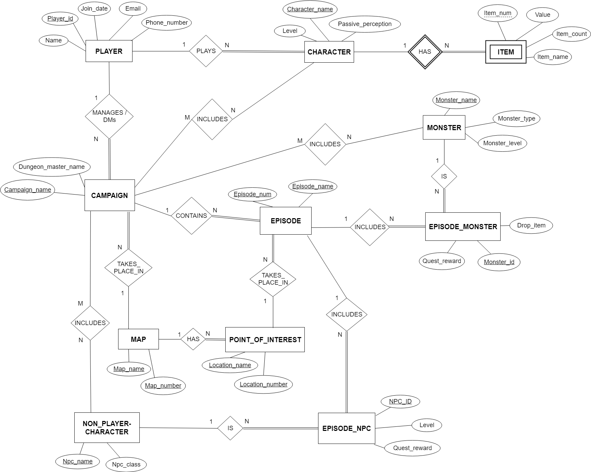

Database D&D Dungeon Master Campaign Manager
============================================
The purpose of this project was the design and implementation of a Relational SQL database utilizing best practices of data modeling, including normalization. PHP was used to demonstrate that the database functioned as intended. A UI design that would make this database truly functional was outside of the scope of the project. 

While digital support for Character play exists, there does not seem to be much support for the managment of a Dungeon Master's Campaign outside of physical papers. Our database saught to fill the need. Only one of our group members had played Dungeons and Dragons and dropped the class midway through, so it's possible our interpretation of the game flow and needs of the Dungeon Master may be incorect.

Entity Relationship Diagram
---------------------------

Relational Model Schema
-----------------------

